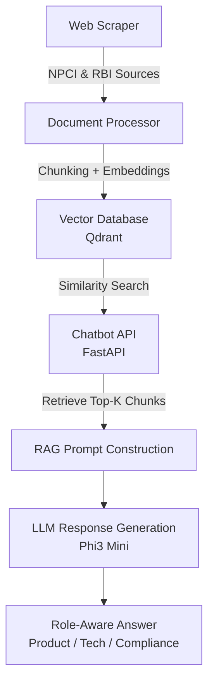

# Bharat Pay Multi-Source Intelligence Chatbot

End-to-end prototype intelligent chatbot for processing internal documents and external web intelligence. Designed for the Bharat Pay AI Engineer assignment.

This project demonstrates a complete AI pipeline — from web scraping and document ingestion to vector search and chatbot query response.

## 📌 Project Highlights

- 📰 Web scraping of NPCI UPI circulars & RBI ATM data

- 📄 Document processing & embedding generation

- 🧠 Vector database search with Qdrant

- 🤖 Chatbot API for query processing

- 🛠 Simulated role-based responses for Product, Tech, and Compliance leads

- ⚡ Lightweight, container-friendly prototype

## 🧰 Tech Stack

```text
COMPONENT	        TECHNOLOGY
Backend API	        FastAPI
Vector Database	    Qdrant
Embeddings	        Sentence Transformers
LLM	                Phi-3 Mini (via Ollama)
Web Scraping	    Requests + BeautifulSoup
Containerization	Docker
API Testing	        Python Client Script
Data Processing	    Custom Python pipeline
```

## 🏗 System Architecture



## 🔄 RAG Pipeline Flow

1️⃣ User submits query

2️⃣ Query embedding generated

3️⃣ Vector similarity search in Qdrant

4️⃣ Top-K relevant document chunks retrieved

5️⃣ Prompt constructed with role context + retrieved chunks

6️⃣ LLM generates role-aware response

## 📂 Repository Structure

```text
Bharat_Pay_Chatbot
│── chatbot/
│   ├── chat_api.py
│   └── client_test.py
│
├── scraper/
│   └── scrape_sources.py
│
├── ingestion/
│   ├── process_documents.py
│   └── generate_embedding.py
│
├── models/
│   ├── embedding.py
│   └── llm.py
│
├── vector_db/
│   └── qdrant_store.py
│
├── data/
├── requirements.txt
└── *.json  # processed chunks with embeddings
```

## ⚙ Installation and Quick Checks

### 0️⃣ Environment

```bash
python3 --version
pip3 --version
```

### 1️⃣ Clone Repo

```bash
git clone https://github.com/shimmer0909/Bharat_Pay_Chatbot.git
cd Bharat_Pay_Chatbot
```

### 2️⃣ Create Virtual Environment

```bash
python -m venv venv
source venv/bin/activate  # Linux/Mac
venv\Scripts\activate     # Windows
```

### 3️⃣ Install Dependencies

```bash
pip install -r requirements.txt
```

### 4️⃣ Run Web Scraper (Download Data) - Already present in the repo

```bash
python scraper/scrape_sources.py
```

### 5️⃣ Process Documents & Generate Embeddings - Already present in the repo

1. Process data
- Run - python3 ingestion/process_documents.py
- Sored in processed_chunks.json

2. Generate Embeddings
- Run - python3 -m ingestion.generate_embedding
- Stored in chunks_with_embeddings.json

### 4️⃣ Start Qdrant Vector DB and Loan Embeddings

```bash
sudo docker run -p 6333:6333 qdrant/qdrant
python3 -m vector_db.qdrant_store
```

You can see collection on http://localhost:6333/dashboard#/collections

### 5️⃣ Run Chatbot API

```bash
python3 -m uvicorn chatbot.chat_api:app --host 0.0.0.0 --port 8000
```

### 6️⃣ Test Queries

```bash
python chatbot/client_test.py
```

## 🧠 Example Role-Aware Response

** Product Lead - **
Focus on feature impact and product strategy

** Tech Lead - **
Focus on technical implementation

** Compliance Lead - **
Focus on regulatory implications
